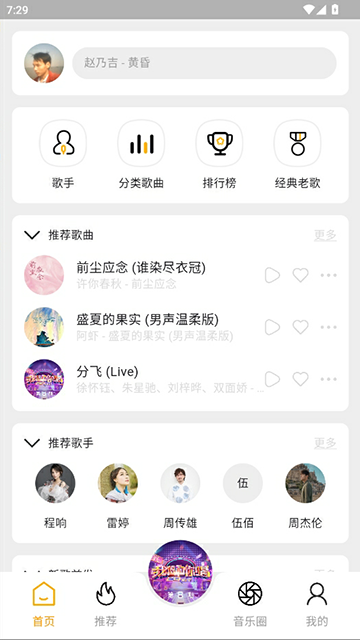
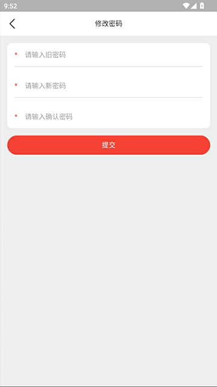
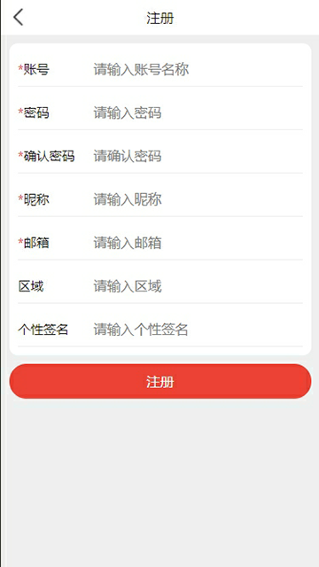
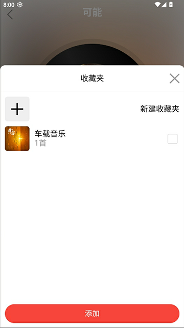
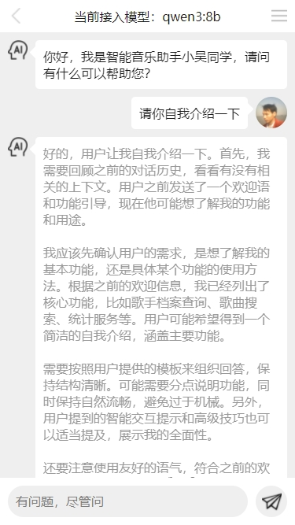
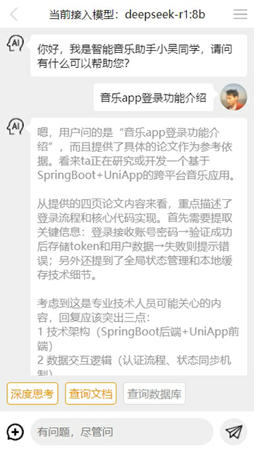
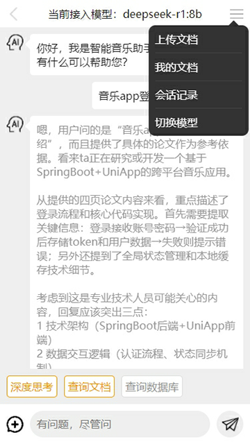
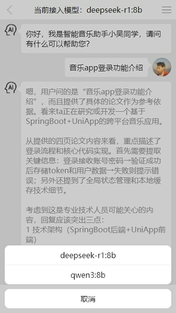

## 项目概述

本项目是一个使用uni-vue3-vite-ts+pinia+router构建的音乐混合App。它集成了AI智能聊天功能，并通过Python爬虫程序从第三方音乐网站获取音乐数据。后端接口采用Spring Boot开发。

## 主要特性

- **跨平台支持**：基于uni-app框架，支持多端发布（如iOS、Android、微信小程序等）。
- **现代化技术栈**：采用Vue 3、TypeScript和Vite进行高效开发。
- **AI智能聊天**：为用户提供智能化的聊天体验。
- **丰富的音乐资源**：利用Python爬虫从酷狗音乐等第三方音乐网站抓取音乐数据。

### 前端核心
- **框架**：UniApp + Vue3 组合式API
- **构建**：Vite4 极速构建
- **状态管理**：Pinia 轻量级状态库
- **类型安全**：TypeScript 全面支持
- **UI组件**：自定义组件库（20+高质量组件）

### 后端对接
- **接口服务**：SpringBoot3 + MyBatis
- **数据来源**：Python 爬虫
- **AI 服务**：SpringAI + ollma + DeepSeek-R1 7B 本地模型

## 核心功能模块详情

### 1. 基础导航
- 底部Tab导航栏
  - 首页
  - 推荐
  - 音乐圈
  - 我的

### 2. 内容展示
- 首页推荐流
- 分类页
  - 音乐分类
  - 电影分类
- 排行榜
- 歌手详情页

### 3. 播放系统
- 音乐/视频播放页
  - 在线播放
  - 进度控制
  - 收藏/缓存功能
- 播放记录同步

### 4. 用户系统
- 登录/注册
  - 手机号+验证码登录
- 个人中心
  - 收藏夹
  - 浏览历史
  - 设置

### 5. 社区互动
- 音乐圈
  - 动态发布
  - 评论点赞
- 关注/粉丝体系

### 6. AI智能
- AI聊天助手
  - 基于Spring AI
  - 集成Ollama本地大模型
- AI推荐
  - RAG检索增强生成

├── src  
│   ├── api          # 接口封装（按模块拆分：music.ts, user.ts, ai.ts）  
│   ├── assets       # 静态资源（图片/音频，按分辨率分包）  
│   ├── components   # 公共组件（Player音乐播放器、AIChat对话框）  
│   ├── pages        # 页面文件夹（按路由拆分：home, playlist, profile）  
│   ├── router       # 路由配置（动态路由权限控制，如/vip/*需登录）  
│   ├── store        # Pinia状态管理（modules: player, user, ai）  
│   ├── utils        # 工具函数（防抖、音频格式转换、时间格式化）  
│   └── App.vue      # 应用入口（全局样式、错误捕获）  
├── static           # 不参与构建的静态文件（如AI模型配置文件）  
├── manifest.json    # 多端发布配置（App权限、小程序AppID）  
├── pages.json       # uniapp页面路由与导航栏配置（支持自定义TabBar）  
└── tsconfig.json    # TypeScript编译配置（严格模式开启）  

通过本项目，开发者可以深入掌握：

跨平台App开发全流程（从设计到多端发布）  
AI与前端结合的实战经验（从接口调用到UI交互）  
高性能音乐播放器的实现（音频解码、缓存策略、跨端同步）  
适合用于毕业设计、企业级应用开发或个人技术博客案例。欢迎Star/Fork，期待协作共建！ 🎵   

=============================界面预览（如果无法预览，请查看项目根目录png文件）==========================   
















=============================界面预览（如果无法预览，请查看项目根目录png文件）==========================   


后端接口项目和sql语句：   
springboot2旧项目：https://github.com/wuyuanwuhui99/springboot-app-service （密钥丢失无法登录，该不在更新，迁移到wuyuanwuhui999账号下）  
springboot2旧项目：https://github.com/wuyuanwuhui999/springboot-app-service  
springboot3新项目：https://github.com/wuyuanwuhui999/springboot3-app-service   
springboot2旧项目：https://gitee.com/wuyuanwuhui99/springboot-app-service   
springboot3新项目：https://gitee.com/wuyuanwuhui99/springboot3-app-service   


flutter电影项目参见:   
github旧地址：https://github.com/wuyuanwuhui99/flutter-movie-app-ui   
github新地址：https://github.com/wuyuanwuhui999/flutter-movie-app-ui   
gitee地址：https://hub.nuaa.cf/wuyuanwuhui99/flutter-movie-app-ui

flutter音乐项目参见:   
github旧地址：https://github.com/wuyuanwuhui99/flutter-music-app-ui   
github新地址：https://github.com/wuyuanwuhui999/flutter-music-app-ui   
gitee地址：https://hub.nuaa.cf/wuyuanwuhui99/flutter-music-app-ui

react native电影参见:   
github地址：https://github.com/wuyuanwuhui99/react-native-app-ui   

java安卓原生电影参见：  
通用地址：https://github.com/wuyuanwuhui99/android-java-movie-app-ui   
gitee地址：https://hub.nuaa.cf/wuyuanwuhui99/android-java-movie-app-ui

uniapp电影参见：
github旧地址：https://github.com/wuyuanwuhui99/uniapp-vite-vue3-ts-movie-app-ui   
github新地址：https://github.com/wuyuanwuhui999/uniapp-vite-vue3-ts-movie-app-ui   
gitee地址：https://gitee/wuyuanwuhui99/uniapp-vite-vue3-ts-movie-app-ui  

uniapp音乐项目参见：
github旧地址：https://github.com/wuyuanwuhui99/uniapp-vite-vue3-ts-music-app-ui   
github新地址：https://github.com/wuyuanwuhui999/uniapp-vite-vue3-ts-music-app-ui   
gitee地址：https://gitee/wuyuanwuhui99/uniapp-vite-vue3-ts-music-app-ui  

微信小程序版本参见：  
通用地址：https://github.com/wuyuanwuhui99/weixin-movie-app-ui、  
国内镜像地址：https://hub.nuaa.cf/wuyuanwuhui99/weixin-movie-app-ui

harmony鸿蒙电影参见:   
github旧地址：https://github.com/wuyuanwuhui99/Harmony_movie_app_ui   
github新地址：https://github.com/wuyuanwuhui999/Harmony_movie_app_ui   
gitee地址：https://hub.nuaa.cf/wuyuanwuhui99/Harmony_movie_app_ui

harmony鸿蒙音乐项目参见:   
github旧地址：https://github.com/wuyuanwuhui99/harmony_music_app_ui   
github新地址：https://github.com/wuyuanwuhui999/harmony_music_app_ui   
gitee地址：https://hub.nuaa.cf/wuyuanwuhui99/harmony_music_app_ui

vue在线音乐项目：  
通用地址：https://github.com/wuyuanwuhui99/vue-music-app-ui   
国内镜像地址：https://hub.nuaa.cf/wuyuanwuhui99/vue-music-app-ui

在线音乐后端项目：  
通用地址：https://github.com/wuyuanwuhui99/koa2-music-app-service   
国内镜像地址：https://hub.nuaa.cf/wuyuanwuhui99/koa2-music-app-service

vue3+ts明日头条项目：  
通用地址：https://github.com/wuyuanwuhui99/vue3-ts-toutiao-app-ui  
国内镜像地址：https://hub.nuaa.cf/wuyuanwuhui99/vue3-ts-toutiao-app-ui   

音乐播放器正在开发中，音乐数据来自于python爬虫程序，爬取酷狗音乐数据，敬请关注

接口和数据请在本地电脑中，暂时没有购买和部署服务器，仅限本地调试，如有需要调试请联系本人启动外网映射

本地调试请把 http://192.168.0.5:5001 改成 http://254a2y1767.qicp.vip    
该地址是映射到本人电脑的地址，需要本人电脑开机才能访问，一般在工作日晚上八点半之后或者周末白天会开机   
如需了解是否已开机，请用浏览器直接打开该地址：http://254a2y1767.qicp.vip，如出现以下提示，则正常使用   


本站所有音乐和图片均来自互联网收集而来，版权归原创者所有，本网站只提供web页面服务，并不提供资源存储，也不参与录制、上传 若本站收录的节目无意侵犯了贵司版权，请联系

联系方式：（微信）wuwenqiang_99、（邮箱）275018723@qq.com

```
uniapp-music-app-ui
├─ .hbuilderx
│  └─ launch.json
├─ index.html
├─ package-lock.json
├─ package.json
├─ README.md
├─ shims-uni.d.ts
├─ src
│  ├─ api
│  │  └─ index.ts
│  ├─ App.vue
│  ├─ common
│  │  ├─ config.ts
│  │  ├─ constant.ts
│  │  └─ enum.ts
│  ├─ components
│  │  ├─ AvaterComponent.vue
│  │  ├─ CommentComponent.vue
│  │  ├─ DialogComponent.vue
│  │  ├─ FavoriteDirectoryComponent.vue
│  │  ├─ MusicAvaterComponent.vue
│  │  ├─ MusicCircleComponent.vue
│  │  ├─ MusicClassifyComponent.vue
│  │  ├─ MusicClassifyListComponent.vue
│  │  ├─ MusicHomeComponent.vue
│  │  ├─ MusicMyComponent.vue
│  │  ├─ MusicRecommentComponent.vue
│  │  ├─ MusicSearchComponent.vue
│  │  ├─ MusicSingerComponent.vue
│  │  ├─ MusicTitleComponent.vue
│  │  ├─ NavigatorTitleComponent.vue
│  │  ├─ OptionsDialog copy.vue
│  │  └─ OptionsDialog.vue
│  ├─ enum
│  │  └─ index.ts
│  ├─ env.d.ts
│  ├─ main.ts
│  ├─ manifest.json
│  ├─ pages
│  │  ├─ AuthorMusicListPage.vue
│  │  ├─ ForgetPasswordPage.vue
│  │  ├─ LaunchPage.vue
│  │  ├─ LoginPage.vue
│  │  ├─ MusicAuthorCategoryPage.vue
│  │  ├─ MusicCategoryListPage.vue
│  │  ├─ MusicCirClePublishPage.vue
│  │  ├─ MusicClassifyListComponent.vue
│  │  ├─ MusicClassifyListPage.vue
│  │  ├─ MusicFavoriteListPage.vue
│  │  ├─ MusicIndexPage.vue
│  │  ├─ MusicPlayerPage.vue
│  │  ├─ MusicSearchPage.vue
│  │  ├─ MusicSharePage.vue
│  │  ├─ RegisterPage.vue
│  │  ├─ ResetPasswordPage.vue
│  │  ├─ UpdatePasswordPage.vue
│  │  └─ UserPage.vue
│  ├─ pages.json
│  ├─ routers
│  │  └─ index.ts
│  ├─ service
│  │  └─ index.ts
│  ├─ shime-uni.d.ts
│  ├─ stores
│  │  └─ useStore.ts
│  ├─ theme
│  │  ├─ color.less
│  │  ├─ size.less
│  │  └─ style.less
│  ├─ types
│  │  └─ index.ts
│  ├─ uni.scss
│  └─ utils
│     ├─ HttpUtils.ts
│     └─ util.ts
├─ static
│  ├─ default_avater.png
│  ├─ default_cover.jpg
│  ├─ icon_add.png
│  ├─ icon_app.png
│  ├─ icon_arrow.png
│  ├─ icon_avater.png
│  ├─ icon_back.png
│  ├─ icon_classify.png
│  ├─ icon_clear.png
│  ├─ icon_close.png
│  ├─ icon_collection.png
│  ├─ icon_collection_active.png
│  ├─ icon_comment.png
│  ├─ icon_comment_white.png
│  ├─ icon_delete.png
│  ├─ icon_detail_play.png
│  ├─ icon_down.png
│  ├─ icon_edit.png
│  ├─ icon_empty_star.png
│  ├─ icon_favorite.png
│  ├─ icon_favorite_add.png
│  ├─ icon_favorite_cover.svg
│  ├─ icon_full_star.png
│  ├─ icon_half_star.png
│  ├─ icon_history.png
│  ├─ icon_home.png
│  ├─ icon_home_active.png
│  ├─ icon_hot.png
│  ├─ icon_like.png
│  ├─ icon_like_active.png
│  ├─ icon_like_white.png
│  ├─ icon_logo.png
│  ├─ icon_menu_add.png
│  ├─ icon_movie.png
│  ├─ icon_movie_active.png
│  ├─ icon_music.png
│  ├─ icon_music_add.png
│  ├─ icon_music_circle.png
│  ├─ icon_music_circle_active.png
│  ├─ icon_music_classics.png
│  ├─ icon_music_classify.png
│  ├─ icon_music_collect.png
│  ├─ icon_music_comments.png
│  ├─ icon_music_default_cover.png
│  ├─ icon_music_down.png
│  ├─ icon_music_like.png
│  ├─ icon_music_loop.png
│  ├─ icon_music_menu.png
│  ├─ icon_music_next.png
│  ├─ icon_music_order.png
│  ├─ icon_music_play.png
│  ├─ icon_music_playing.png
│  ├─ icon_music_playing_grey.png
│  ├─ icon_music_play_menu.png
│  ├─ icon_music_play_white.png
│  ├─ icon_music_prev.png
│  ├─ icon_music_random.png
│  ├─ icon_music_rank.png
│  ├─ icon_music_singer.png
│  ├─ icon_music_white_menu.png
│  ├─ icon_no1.png
│  ├─ icon_no2.png
│  ├─ icon_no3.png
│  ├─ icon_password.png
│  ├─ icon_permission.png
│  ├─ icon_play.png
│  ├─ icon_play_record.png
│  ├─ icon_recomment.png
│  ├─ icon_recomment_active.png
│  ├─ icon_record.png
│  ├─ icon_search.png
│  ├─ icon_send.png
│  ├─ icon_share.png
│  ├─ icon_share_music.png
│  ├─ icon_talk.png
│  ├─ icon_top.png
│  ├─ icon_tv.png
│  ├─ icon_tv_active.png
│  ├─ icon_user.png
│  ├─ icon_user_active.png
│  └─ logo.png
├─ tsconfig.json
├─ unpackage
│  ├─ res
│  │  └─ icons
│  │     ├─ 1024x1024.png
│  │     ├─ 120x120.png
│  │     ├─ 144x144.png
│  │     ├─ 152x152.png
│  │     ├─ 167x167.png
│  │     ├─ 180x180.png
│  │     ├─ 192x192.png
│  │     ├─ 20x20.png
│  │     ├─ 29x29.png
│  │     ├─ 40x40.png
│  │     ├─ 58x58.png
│  │     ├─ 60x60.png
│  │     ├─ 72x72.png
│  │     ├─ 76x76.png
│  │     ├─ 80x80.png
│  │     ├─ 87x87.png
│  │     └─ 96x96.png
│  └─ resources
│     └─ __UNI__0D01F9F
│        └─ www
│           ├─ app-config-service.js
│           ├─ app-config.js
│           ├─ app-service.js
│           ├─ app.css
│           ├─ assets
│           │  ├─ default_avater.f4259db5.png
│           │  ├─ default_cover.d3df9517.jpg
│           │  ├─ icon_collection_active.e58a0a87.png
│           │  ├─ icon_favorite.8f14792a.png
│           │  ├─ icon_full_star.06ff4e10.png
│           │  ├─ icon_like.b458a743.png
│           │  ├─ icon_like_active.b5e321df.png
│           │  ├─ icon_music_collect.37256d1e.png
│           │  ├─ icon_music_loop.c1732e85.png
│           │  ├─ icon_music_order.de7f6bca.png
│           │  ├─ icon_music_play.8894f226.png
│           │  ├─ icon_music_playing.078c77db.png
│           │  ├─ icon_music_playing_grey.ea2c3a08.png
│           │  ├─ icon_music_play_white.46465068.png
│           │  ├─ icon_music_random.cb2d1974.png
│           │  └─ uniicons.89ed7d6d.ttf
│           ├─ manifest.json
│           ├─ movie
│           │  └─ pages
│           │     ├─ IndexPage.css
│           │     ├─ LaunchPage.css
│           │     ├─ MovieDetailPage.css
│           │     ├─ MovieLoginPage.css
│           │     ├─ MoviePlayPage.css
│           │     ├─ MovieRegisterPage.css
│           │     ├─ MovieSearchPage.css
│           │     └─ MovieUserPage.css
│           ├─ music
│           │  └─ pages
│           │     ├─ AuthorMusicListPage.css
│           │     ├─ MusicAuthorCategoryPage.css
│           │     ├─ MusicCategoryListPage.css
│           │     ├─ MusicCirClePublishPage.css
│           │     ├─ MusicClassifyListPage.css
│           │     ├─ MusicFavoriteListPage.css
│           │     ├─ MusicIndexPage.css
│           │     ├─ MusicPlayerPage.css
│           │     ├─ MusicSearchPage.css
│           │     └─ MusicSharePage.css
│           ├─ uni-app-view.umd.js
│           ├─ __uniappautomator.js
│           ├─ __uniappchooselocation.js
│           ├─ __uniapperror.png
│           ├─ __uniappopenlocation.js
│           ├─ __uniapppicker.js
│           ├─ __uniappquill.js
│           ├─ __uniappquillimageresize.js
│           ├─ __uniappscan.js
│           ├─ __uniappsuccess.png
│           └─ __uniappview.html
├─ vite.config.ts
├─ yarn.lock
├─ 一键提交到gitee.bat
├─ 一键提交到github.bat
├─ 分类歌曲.png
├─ 外网映射正常访问提示.png
├─ 更改用户信息1.png
├─ 更改用户信息2.png
├─ 更改用户信息3.png
├─ 更改用户信息4.png
├─ 用户信息.png
├─ 登录.png
├─ 音乐分享.png
├─ 音乐圈评论.png
├─ 音乐我的1.jpg
├─ 音乐我的2.png
├─ 音乐推荐.jpg
├─ 音乐搜索列表.png
├─ 音乐播放页.jpg
├─ 音乐播放页.png
├─ 音乐收藏列表.png
├─ 音乐朋友圈1.jpg
├─ 音乐朋友圈2.png
├─ 音乐歌手专辑页.png
├─ 音乐歌手页.jpg
├─ 音乐歌手页.png
├─ 音乐歌词页.png
├─ 音乐点赞和评论.png
└─ 音乐首页.jpg

```